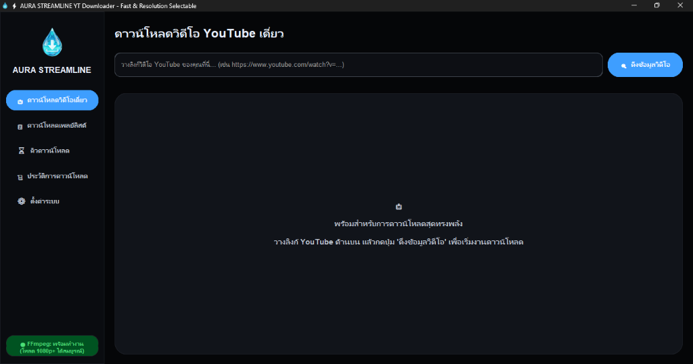

# 💧 Aura Streamline YT Downloader

<div align="center">


<p align="center">
  A premium, high-speed Windows desktop YouTube downloader featuring a stunning, immersive <b>fluid glassmorphic UI</b> (Frutiger Aero / Glassmorphism inspired). Aura Streamline delivers out-of-the-box high-resolution video combining and audio conversion without requiring command-line or terminal interaction.
</p>

### 📸 Beautiful Obsidian Dark Mode Interface
</div>



---

## ✨ Premium Features & Design Philosophy

* **🌀 Immersive Glassmorphic UI:** A beautifully tactile and modern interface built using curated harmonious color palettes, rounded card surfaces, subtle hover micro-animations, and fluid design layouts.
* **🌓 Seamless Dual-Theme Engine:** Fully responsive real-time theme transitions between a bright, clean crystal theme (**Light Mode**) and a premium deep obsidian theme (**Dark Obsidian Mode**).
* **🖱️ Theme-Aware Right-Click Menu:** Custom right-click entry menus that dynamically detect the window's current appearance mode and re-color themselves instantly for an integrated visual experience.
* **📥 Single Video Engine:** Paste any YouTube video URL to automatically fetch rich metadata (cover artwork, channel info, title, and exact duration) and select custom resolutions (from 360p up to 4K Ultra HD).
* **📋 Playlist Batch Downloader:** Fetch entire playlists, select specific videos using interactive checkbox cards, and queue them for batch downloading with a single click.
* **🎵 High-Fidelity Audio Extractor:** Seamlessly strip audio streams and automatically convert them into crisp 192kbps MP3 format.
* **⏳ Concurrent Queue Manager:** A robust background multi-threaded manager that handles downloads in an orderly queue while keeping the main GUI completely responsive (0% lag).
* **⚙️ Built-In Portable FFmpeg:** Bundled natively in the installer package to merge separate HD video/audio streams and convert audio on the fly—zero external setup or PATH configuration required!
* **📜 Download History Database:** Tracks successful downloads locally in a secure SQLite database, allowing you to open containing folders or manage history entries directly from the UI.

---

## 🚀 Installation & Launch Options

### 📦 Option A: Professional Windows Setup Wizard (Recommended for Users)
Install the application cleanly without requiring Python, terminal commands, or administrator access.

1. Navigate to the **`dist/`** directory in this repository.
2. Double-click the professional installer: **`AuraStreamline_Setup.exe`** (Highly compressed using solid LZMA from 440 MB down to **~111 MB**).
3. Follow the clean, localized setup wizard (supports creating desktop shortcuts).
4. Launch the application immediately upon completion.
5. *Uninstallation is fully supported natively through the Windows Settings page (Apps > Installed Apps > Search "Aura Streamline" > Uninstall).*

---

### 💻 Option B: Developer Environment Setup (For Developers)
If you want to run, modify, or audit the source code directly on your machine:

1. Clone or download this project, and open a terminal inside the `yt-download/` directory.
2. Create a clean virtual environment to prevent package version conflicts:
   ```powershell
   python -m venv .venv
   ```
3. Install the required dependencies:
   ```powershell
   .venv\Scripts\pip.exe install -r requirements.txt
   ```
4. Run the main application:
   ```powershell
   .venv\Scripts\python.exe main.py
   ```
5. *(The app will automatically check for FFmpeg. If not present in the environment, you can install the portable engine in one click via the bottom-left sidebar button)*.

---

## 📁 Repository Structure

```text
yt-download/
│
├── bin/                    # Portable FFmpeg binaries (ffmpeg.exe, ffprobe.exe)
├── data/                   # Local history metadata stored in SQLite (.db) format
├── dist/                   # Production distribution folder
│   ├── main/               # Unpackaged compiled application distribution
│   └── AuraStreamline_Setup.exe  # Standalone Windows Setup Installer wizard
│
├── downloader.py           # Core download controller & metadata parser (yt-dlp wrapper)
├── history_db.py           # SQLite manager for download history
├── queue_manager.py        # Multi-threaded download queue controller
├── main.py                 # Core GUI layout & dynamic responsive layout styling
│
├── logo.png / logo.ico     # Brand identity water droplet assets
├── setup.iss               # Inno Setup installer specification script
├── requirements.txt        # Python package dependencies list
└── README.md               # This documentation file
```

---

## 🔒 Security, Privacy & Architecture

* **Lowest-Privilege Installation:** The setup installer is designed with `PrivilegesRequired=lowest`. It installs cleanly inside the user's Local AppData directory (`%LOCALAPPDATA%\Programs`), bypasses UAC elevation warnings, and prevents modifying sensitive system-wide directories.
* **100% Local Processing:** Your search queries, downloaded video logs, history logs, and database files are processed locally. No user analytics, cookies, or video URLs are transmitted to external telemetry servers.
* **Clean Code Architecture:** Completely modular codebase divided cleanly between the UI presentation layer (`main.py`) and the background engines, ensuring audits and improvements are straightforward.
